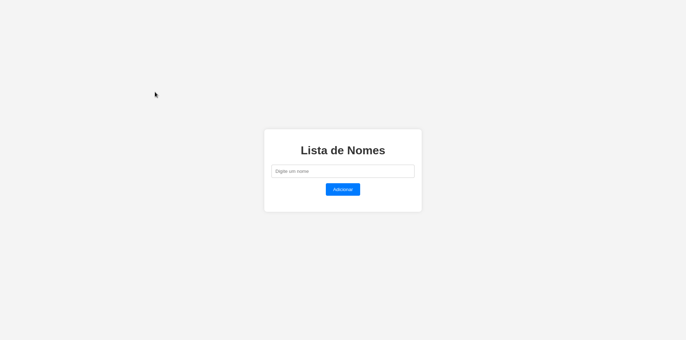

# Projeto de estudo - Java, Spring Boot, React e TypeScript

Projeto para a prática de Java, Spring Boot, React e TypeScript.

## Funcionalidades do projeto

- Cadastrar, visualizar, editar e excluir nomes.

## Gif do projeto

## Como rodar o projeto

- Na pasta "backend", executar `mvn clean install` e `mvn spring-boot:run`;
  - **Obs.:** utilizar Java 21.
- Na pasta "frontend", executar `npm install` e `npm start`.
